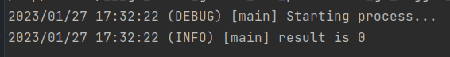
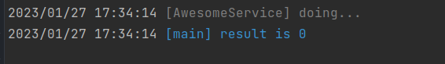

# Simple Go logger

Ease-to-use wrapper for logger from standard library

## Usage

### basic

```go
package main

import (
	logger "github.com/piunov1998/go-logger"
)

func main() {
	log := logger.New("main", logger.BasicConfig())
	log.SetLevel(logger.DebugLevel)

	log.Debug("Starting process...")

	result, err := process()
	if err != nil {
		log.Errorf("error during process -> %s", err)
	}
	log.Infof("result is %d", result)
}

func process() (int, error) {
	// make some stuff
	return 0, nil
}
```



### advanced

```go
package main

import (
	logger "github.com/piunov1998/go-logger"
)

type AwesomeService struct {
	logger logger.Logger
}

func New() AwesomeService {
	service := AwesomeService{}
	service.logger = logger.New(service, logger.Config{Colors: true, LogLevel: "debug"})
	return service
}

func (a AwesomeService) Do() (int, error) {
	a.logger.Debug("doing...")
	// doing...
	return 0, nil
}

func main() {
	log := logger.New("main", logger.Config{Colors: true, LogLevel: "info"})
	service := New()
	if result, err := service.Do(); err != nil {
		log.Fatalf("error during workflow -> %s", err)
	} else {
		log.Infof("result is %d", result)
	}
}
```



## Available levels
* `debug` 
* `info`
* `warning`
* `error`
* `fatal`
